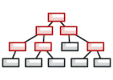
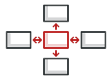

# 目录

## 创建型模式
> 这类模式提供创建对象的机制， 能够提升已有代码的灵活性和可复用性。

|   类型   |   图稿   |   简述   |
| ---- | ---- | ---- |
|[**工厂方法**](design-patterns/factoryMethod) Factory Method | | 定义一个用于创建产品的接口，由子类决定生产什么产品。|
|[**抽象工厂**](design-patterns/abstractFactory) Abstract Factory |      |提供一个创建产品族的接口，其每个子类可以生产一系列相关的产品。|
|[**建造者**](design-patterns/builder) Builder      |      |将一个复杂对象分解成多个相对简单的部分，然后根据不同需要分别创建它们，最后构建成该复杂对象。|
|[**原型**](design-patterns/prototype)  Prototype     |      |将一个对象作为原型，通过对其进行复制而克隆出多个和原型类似的新实例。|
|[**单例**](design-patterns/singleton) Singleton      |     |某个类只能生成一个实例，该类提供了一个全局访问点供外部获取该实例，其拓展是有限多例模式。|

## 结构型模式
> 这类模式介绍如何将对象和类组装成较大的结构， 并同时保持结构的灵活和高效。

|   类型   |   图稿   |   简述   |
| ---- | ---- | ---- |
|[**适配器**](design-patterns/adapter) Adapter |      |将一个类的接口转换成客户希望的另外一个接口，使得原本由于接口不兼容而不能一起工作的那些类能一起工作。|
|[**桥接**](design-patterns/bridge) Bridge |      |将抽象与实现分离，使它们可以独立变化。它是用组合关系代替继承关系来实现的，从而降低了抽象和实现这两个可变维度的耦合度。|
|[**组合**](design-patterns/composite) Composite      |      |将对象组合成树状层次结构，使用户对单个对象和组合对象具有一致的访问性。|
|[**装饰**](design-patterns/decorator)  Decorator     |      |动态地给对象增加一些职责，即增加其额外的功能。|
|[**外观**](design-patterns/facade) Facade      |     |为多个复杂的子系统提供一个一致的接口，使这些子系统更加容易被访问。|
|[**享元**](design-patterns/flyweight) Flyweight      |     |运用共享技术来有效地支持大量细粒度对象的复用。|
|[**代理**](design-patterns/proxy) Proxy      |     |为某对象提供一种代理以控制对该对象的访问。即客户端通过代理间接地访问该对象，从而限制、增强或修改该对象的一些特性。|

## 行为型模式
> 这类模式负责对象间的高效沟通和职责委派。

|   类型   |   图稿   |   简述   |
| ---- | ---- | ---- |
|[**责任链**](design-patterns/chain) Chain of Responsibility |      |把请求从链中的一个对象传到下一个对象，直到请求被响应为止。通过这种方式去除对象之间的耦合。|
|[**命令**](design-patterns/command) Command |      |将一个请求封装为一个对象，使发出请求的责任和执行请求的责任分割开。|
|[**迭代器**](design-patterns/iterator) Iterator      |      |提供一种方法来顺序访问聚合对象中的一系列数据，而不暴露聚合对象的内部表示。|
|[**中介者**](design-patterns/mediator)  Mediator     |      |定义一个中介对象来简化原有对象之间的交互关系，降低系统中对象间的耦合度，使原有对象之间不必相互了解。|
|[**备忘录**](design-patterns/memento) Memento      |     |在不破坏封装性的前提下，获取并保存一个对象的内部状态，以便以后恢复它。|
|[**观察者**](design-patterns/observer) Observer      |     |多个对象间存在一对多关系，当一个对象发生改变时，把这种改变通知给其他多个对象，从而影响其他对象的行为。|
|[**状态**](design-patterns/state) State      |     |允许一个对象在其内部状态发生改变时改变其行为能力。|
|[**策略**](design-patterns/strategy) Strategy      |     |定义了一系列算法，并将每个算法封装起来，使它们可以相互替换，且算法的改变不会影响使用算法的客户。|
|[**模板方法**](design-patterns/templateMethod) Template Method      |     |定义一个操作中的算法骨架，将算法的一些步骤延迟到子类中，使得子类在可以不改变该算法结构的情况下重定义该算法的某些特定步骤。|
|[**访问者**](design-patterns/visitor) Visitor      |     |在不改变集合元素的前提下，为一个集合中的每个元素提供多种访问方式，即每个元素有多个访问者对象访问。|
|[**解释器**](design-patterns/interpreter) Interpreter      |    |提供如何定义语言的文法，以及对语言句子的解释方法，即解释器。|