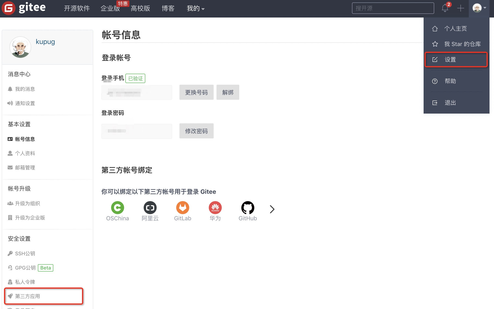
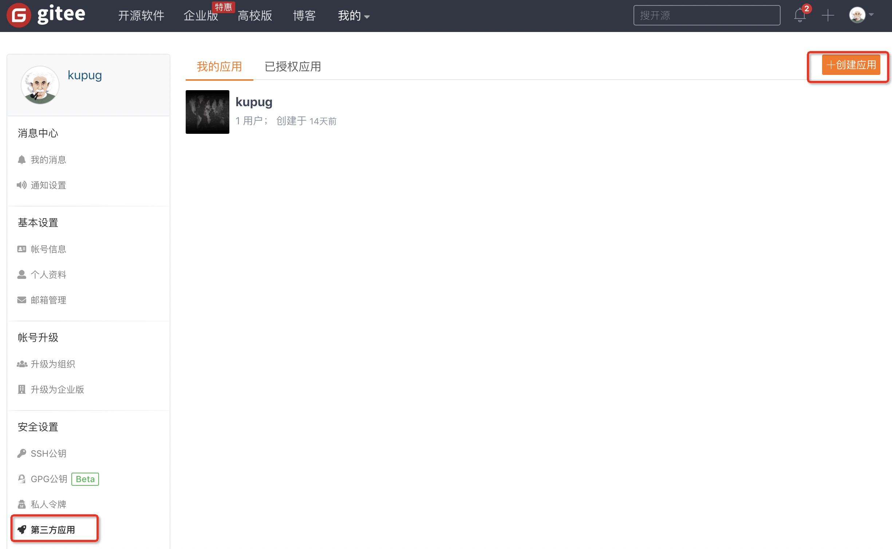
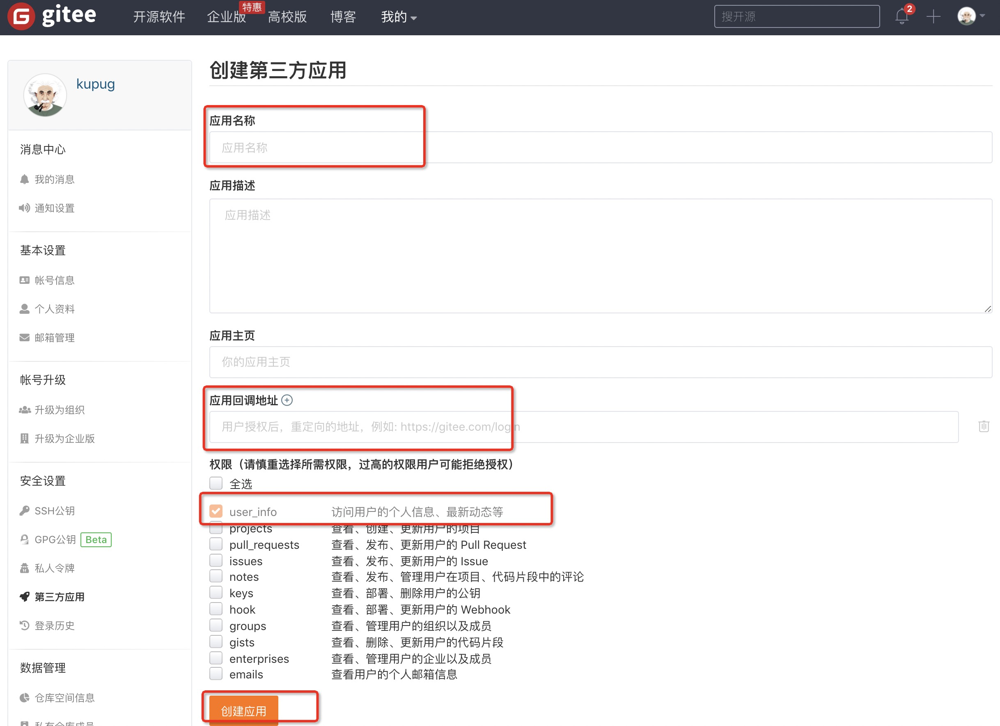
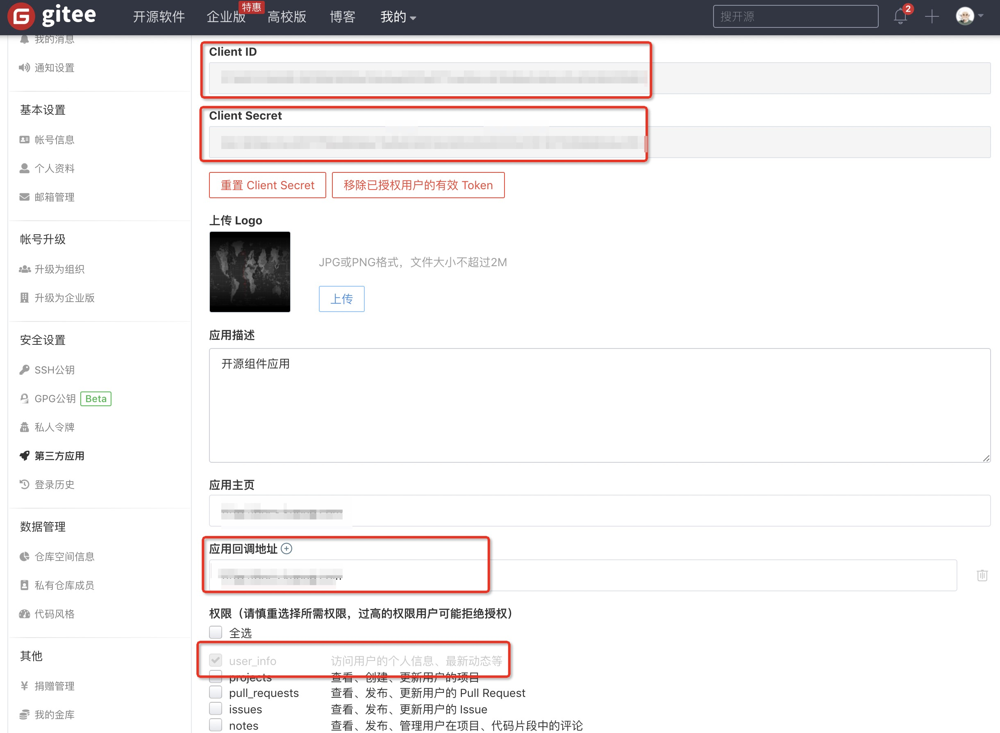

# Gitee 授权登录

## 创建应用

1. **注册账号**

注册Gitee账号：[https://gitee.com](https://gitee.com)。如果已有则忽略该步骤，直接进入第二步。 

2. **创建应用**

在 [设置](https://gitee.com/profile/account_information) -> [第三方应用](https://gitee.com/oauth/applications)，创建要接入码云的应用。 

**个人资料设置页面**



**应用列表页面**



**创建应用页面**



- `应用回调地址` **重点**，该地址为用户授权后需要跳转到的自己网站的地址，默认携带一个code参数
- `权限` 根据页面提示操作，默认勾选第一个就行。

**应用详情页面**



**注:** 保存好这三个信息：`Client ID`、`Client Secret` 和 `应用回调地址`，集成 `KuOAuth` 时会使用到。


## 集成KuOAuth

1. **引入依赖**

```maven
<dependency>
  <groupId>com.kupug.kuoauth</groupId>
  <artifactId>kupug-kuoauth</artifactId>
  <version>${latest.version}</version>
</dependency>
```

2. **创建授权登录平台对象**

```java
// 构建 OAuth 平台配置
KuOAuthConfig config = KuOAuthConfig.builder()
    .clientId("Client ID")
    .clientSecret("Client Secret")
    .redirectUri("应用回调地址")
    .build();

// 创建授权登录平台对象
KuOAuthPlatform platform = PlatformFactory.newInstance(Platform.GITEE, config);
```

配置信息如下：
> `scope` 配置，可以参考: com.kupug.kuoauth.platform.IOAuthScope 的实现类

- String `clientId` 客户端id，对应平台的 `Client ID`；
- String `clientSecret` 客户端Secret，对应平台的 `Client Secret`；
- String `redirectUri` 授权登录成功后的回调地址，用于通知客户端接收授权码 `code` 和其它相关信息；
- List `scopes` 授权 scope 的值，如果你的应用开通了更多 `scope`， 可以重置它；
- boolean `ignoreCheckState` 忽略校验 `state` 参数，默认不开启，<strong style="color:red">如非特殊需要，不建议开启这个配置</strong>。


3. **获取授权链接**

```java
// 授权登录后会回调 redirectUri，并带上 code、state
String authorizeUrl = platform.authorize("state");
```

**注：** `state` 建议 `必传`！`state` 的主要作用就是保证请求完整性，防止CSRF风险。

获取到 `authorizeUrl` 后，可以直接跳转到 `authorizeUrl` 上，或者交付给前端页面进行跳转到 `authorizeUrl` 上

4. **登录(获取用户信息)** 

```java
// 构建回调参数对象
KuOAuthCallback oAuthCallback = KuOAuthCallback.buider()
    .code("authorize code")
    .state("authorize state")
    .build();

// 授权登录
KuOAuthLogin oAuthLogin = platform.login(oAuthCallback);
```

**注：** 可以用 `KuOAuthCallback` 类作为 `Login` 接口的入参

5. **完整代码（SpringBoot）**
> 假设产品应用是前后端分离的

```java
import com.kupug.kuoauth.KuOAuthPlatform;
import com.kupug.kuoauth.model.KuOAuthCallback;
import com.kupug.kuoauth.model.KuOAuthConfig;
import com.kupug.kuoauth.model.KuOAuthLogin;
import com.kupug.kuoauth.model.Platform;
import com.kupug.kuoauth.platform.PlatformFactory;
import com.kupug.kuoauth.utils.OAuthUtils;
import org.springframework.web.bind.annotation.GetMapping;
import org.springframework.web.bind.annotation.PostMapping;
import org.springframework.web.bind.annotation.RequestBody;
import org.springframework.web.bind.annotation.RequestMapping;
import org.springframework.web.bind.annotation.RestController;

@RestController
@RequestMapping("/gitee")
public class GiteeAuthController {

    @GetMapping("/authorize")
    public String generateAuthorizeUrl() {

        KuOAuthPlatform  platform = generatePlatform();

        return platform.authorize(OAuthUtils.randomState());
    }

    @PostMapping("/login")
    public Object login(@RequestBody KuOAuthCallback oAuthCallback) {

        KuOAuthPlatform  platform = generatePlatform();

        KuOAuthLogin oAuthLogin = platform.login(oAuthCallback);

        // @todo 获取到第三方账号信息后，与本系统的账号信息做绑定等相关逻辑处理，并生成用户登录信息，返回给客户端

        return Object;
    }

    private KuOAuthPlatform generatePlatform() {
        KuOAuthConfig config = KuOAuthConfig.builder()
            .clientId("Client ID")
            .clientSecret("Client Secret")
            .redirectUri("应用回调地址")
            .build();
            
        return PlatformFactory.newInstance(Platform.GITEE, config);
    }
}
```

## 参考资料
- [Gitee Developer OAuth 文档](https://gitee.com/api/v5/oauth_doc#/list-item-1)